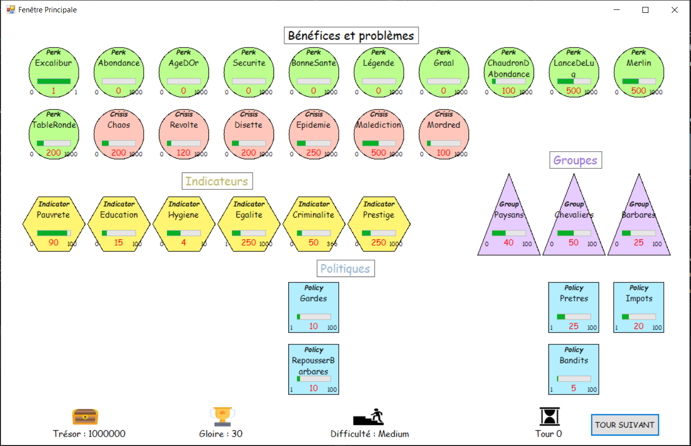
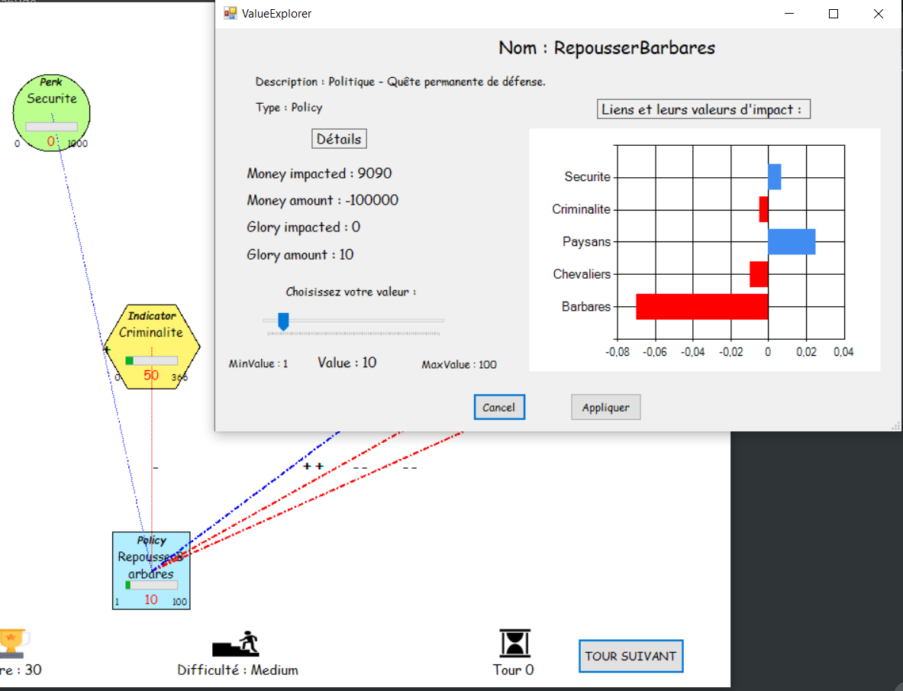

# Projet Democracy C#

## Duration : 10 sessions of 2 hours

Objective: from a game that only works by being able to type commands of type "command xyz", program the graphical interface allowing to manipulate the entities of the game, perform actions with the mouse (without commands) and visualize the statistical data.

The professor drew inspiration from the game Democracy and provided as a basis of code the rules of the game and the entities already programmed. The goal of this game is to manage well, through the policies, the population so as not to be in crisis and therefore lose. The crisis can come from several factors: wars, epidemics, famines, etc. The policies (in blue below) must be modified, and over the rounds other policies will be available and will appear in the empty parts.

There are new possibilities, you can:

- Choose the difficulty of the starting level
- Select a "policy" and change its value
- View statistics and indications of benefits and benefits in diagram form
- Put the mouse cursor over an entity to know the important links (-, ++, etc) with the other entities of the game
